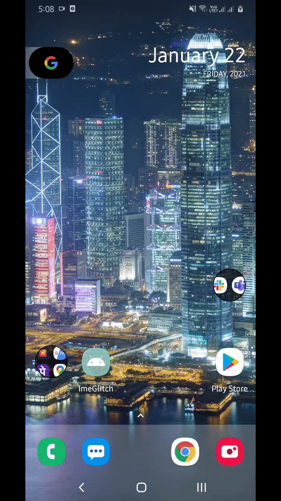

# Jetpack Compose IME Glitch
Reproducible  example of keyboard glitch while using **Jetpack Compose**, **accompanist** with **FragmentContainerView**

## Library versions
* Jetpack Compose: 1.0.0-alpha10
* Accompanist: 0.4.2
* Fragment: 1.3.0-alpha07

## Issue
IME insets are not triggered on first run, giving it a second attempt makes it work.

